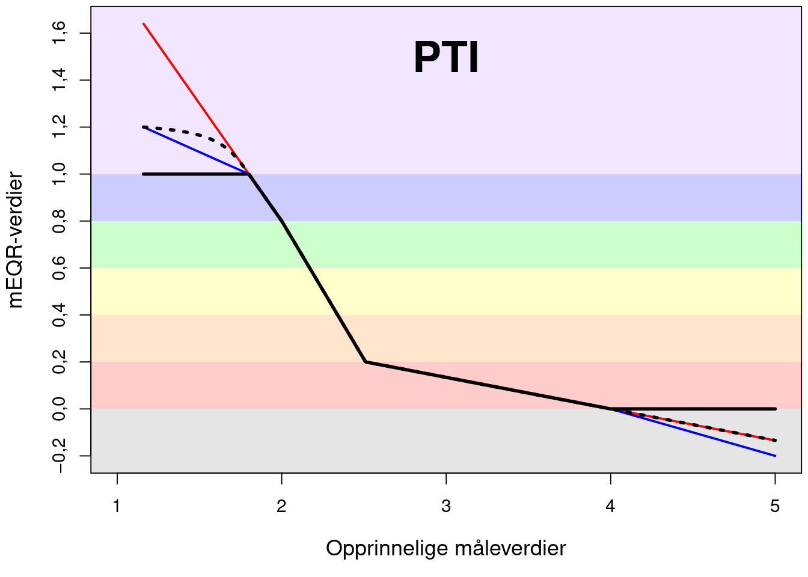

# Beregning av mEQR-verdier

En rekke vannforskriftsparametere kan få måleverdier som er _bedre_ enn **referanseverdien** (beste grense for svært god tilstand) eller _dårligere_ enn "**nullverdien**" (dårligste grense for svært dårlig tilstand).
Standardprosedyren ifølge vannforskriften ([veileder 02:2018](https://www.vannportalen.no/veiledere/klassifiseringsveileder/), s. 37) er å trunkere slike måleverdier, slik at de førstnevnte får en nEQR-verdi på 1 og de sistnevnte en nEQR-verdi på 0.
For å estimere usikkerhet i naturindeksen er det derimot viktig å ikke skjule denne variabiliteten i måleverdier.
Derfor har Sandvik ([2019](http://hdl.handle.net/11250/2631056), s. 13&ndash;15) foreslått å beregne "mEQR-verdier", som bare skiller seg fra nEQR-verdier i at de ikke blir trunkert.

Imidlertid forutsetter denne løsninga at man besvarer et oppfølgingsspørsmål:
Hvilken transformasjon skal man bruke på de overskytende verdiene (bedre enn referanseverdi eller dårligere enn nullverdi) for å skalere dem til mEQR-skala?
Svaret er ikke gitt i vannforskriften (som jo unngår spørsmålet ved trunkering), og det er heller ikke trivielt.
Løsninga som nå er implementert i funksjonen `[mEQR](mEQR.md)`, tar utgangspunkt i formelen for nEQR:

§§\mathrm{nEQR} = S_{\mathrm{n}} + 0,2 \cdot \displaystyle \frac{x - V_{\mathrm{n}}}{V_{\mathrm{ø}} - V_{\mathrm{n}}} §§

der _S_n er den nedre terskelverdien for den respektive tilstandsklassen på nEQR-skala, _V_n er den nedre terskelverdien for den respektive tilstandsklassen på parameterens opprinnelig måleskala, _V_ø er den øvre terskelverdien for den respektive tilstandsklassen på parameterens opprinnelig måleskala, og _x_ er parameterens måleverdi.

Beregning av mEQR følger beregning av nEQR for alle måleverdier mellom null- og referanseverdi.
For de øvrige måleverdiene er beregninga slik:

- I utgangspunktet brukes samme transformasjon (dvs. samme stigningstall) som den tilstøtende tilstandsklassen. Det vil si at mEQR for måleverdier som er bedre enn referanseverdien, beregnes med samme formel som måleverdier i svært god tilstand (med _S_n = 0,8 og _V_ø = referanseverdien), og mEQR for måleverdier som er dårligere enn nullverdien, beregnes med samme formel som måleverdier i svært dårlig tilstand (med _S_n = 0,0 og _V_n = nullverdien).
- Hvis denne verdien imidlertid er større enn 1,2 eller mindre enn &minus;0,2, erstattes den lineære transformasjonen med en asymptotisk funksjon som begynner med samme stigningstall som i den tilstøtende tilstandsklassen, og som har 1,2 som sin høyeste verdi (for måleverdier som er bedre enn referanseverdien) eller &minus;0,2 som sin laveste verdi (for måleverdier som er dårligere enn nullverdien).

## Illustrasjoner

De følgende figurene illustrerer hvordan skaleringa fra måleverdi til mEQR-verdi ser ut for de tolv parametrene som er klargjort for dataflyt:

...

## Begrunnelse

## Alternative beregningsmåter

Den følgende figuren bruker PTI for å illustrere ulike måter å håndtere overskytende verdier på:

1. Gjennomtrukket svart linje: nEQR. Vannforskriftens tilnærming er å trunkere EQR-verdier som er større enn 1, til 1, og de som er mindre enn 0, til 0.
2. Rød linje: lineær forlengelse av transformasjonene som er valgt for de tilstøtende tilstandsklassene. Resultatet kan være verdier som er vesentlig mye større enn 1 eller vesentlig mye mindre enn 0.
3. Blå linje: lineær begrensning til intervallet mellom &minus;0,2 og +1,2. Dette er løsninga som ble foreslått av Sandvik (2019), men den leder til uheldige knekk ved 1 og 0.
4. Punktert svart line: forlengelse av transformasjonene som er valgt for de tilstøtende tilstandsklassene, men med en asymptotisk begrensning til intervallet mellom &minus;0,2 og +1,2. Dette er løsninga som nå er implementert i koden (fra og med versjon 1.2).

